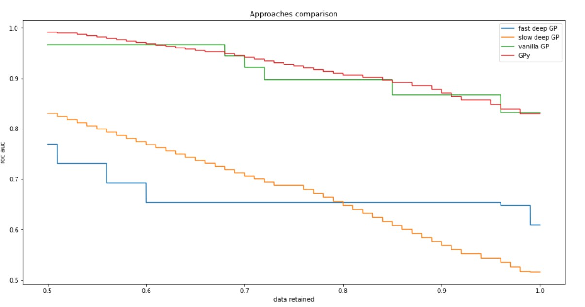

# Vayser-BS-Thesis

Исследуется задача эффективного применения гауссовских процессов к задаче классификации. Рассматривается аппроксимация Лапласа для получения сопряженности апостериорного распределения. Используется факторизация матрицы ковариации. Исследуются эффективные подходы к сэмплированию. Weight space view , function space view. 

Требования содержатся в файле `requirements.txt`

Пример работы можно посмотреть в файле [LaplaceApproximation.ipynb](https://github.com/Intelligent-Systems-Phystech/Vayser-BS-Thesis/blob/main/LaplaceApproximation.ipynb)

Текущие результаты:

